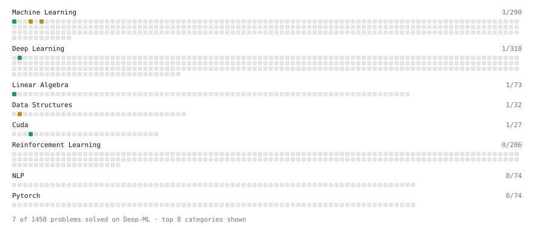

# Deep-ML

My machine learning practice from [Deep-ML](https://www.deep-ml.com). Every solution here was written by hand.

**7** solved · 6 problems · 0 labs · 1 math

[**Browse the interactive portfolio**](https://marcianoo21.github.io/deep-ml/) to replay this filling in over time.

## Problems

| | Difficulty | Solved | |
| --- | --- | --- | --- |
| [Linear Regression Using Normal Equation](https://www.deep-ml.com/problems/14) | easy | 2026-09-17 | [solution](problems/0014-linear-regression-using-normal-equation) |
| [Matrix-Vector Dot Product](https://www.deep-ml.com/problems/1) | easy | 2026-09-17 | [solution](problems/0001-matrix-vector-dot-product) |
| [Your First CUDA Kernel: Thread Index](https://www.deep-ml.com/problems/1201) | easy | 2026-09-23 | [solution](problems/1201-your-first-cuda-kernel-thread-index) |
| [Handle Missing Data with Imputation](https://www.deep-ml.com/problems/354) | medium | 2026-09-23 | [solution](problems/0354-handle-missing-data-with-imputation) |
| [K-Means Clustering](https://www.deep-ml.com/problems/17) | medium | 2026-09-20 | [solution](problems/0017-k-means-clustering) |
| [Principal Component Analysis (PCA) Implementation](https://www.deep-ml.com/problems/19) | medium | 2026-09-21 | [solution](problems/0019-principal-component-analysis-pca-implementation) |

## Math

| | Difficulty | Solved | |
| --- | --- | --- | --- |
| [ML Workflow Basics](https://www.deep-ml.com/math-problems/30) | easy | 2026-09-20 | [solution](math/0030-ml-workflow-basics) |

---

_This file is regenerated by Deep-ML on every push._
